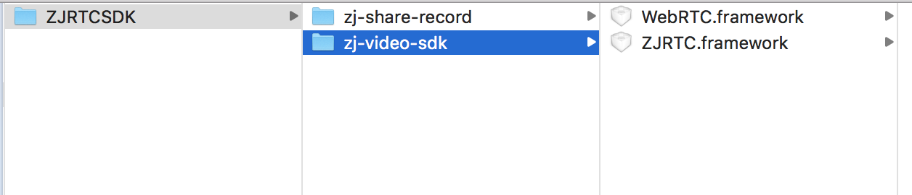
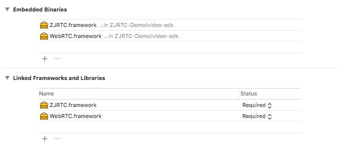
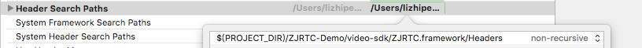
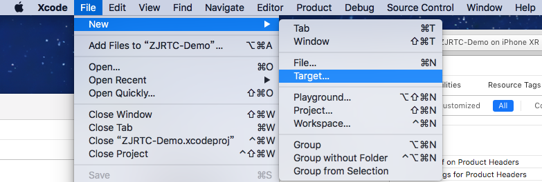
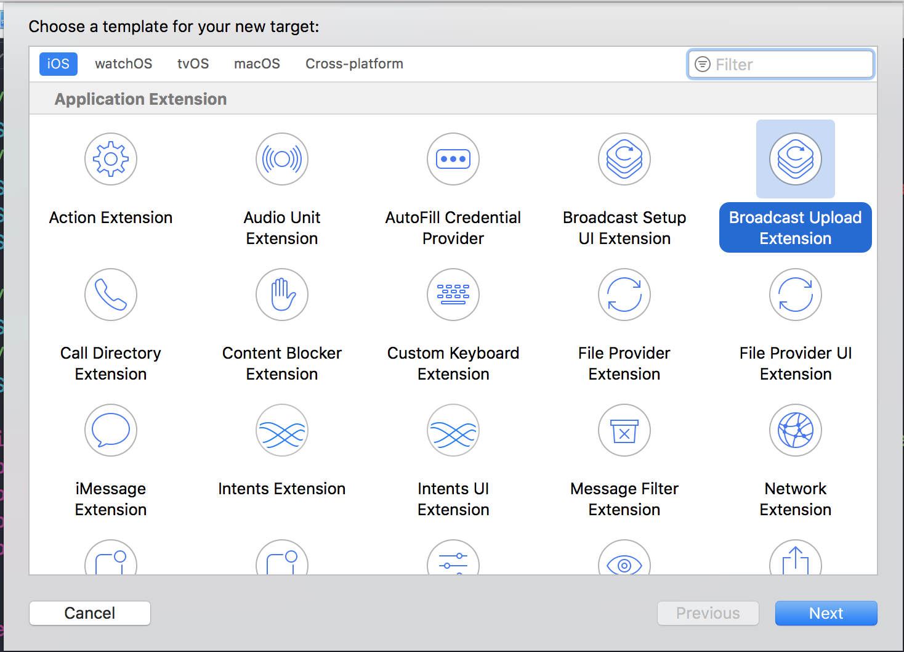
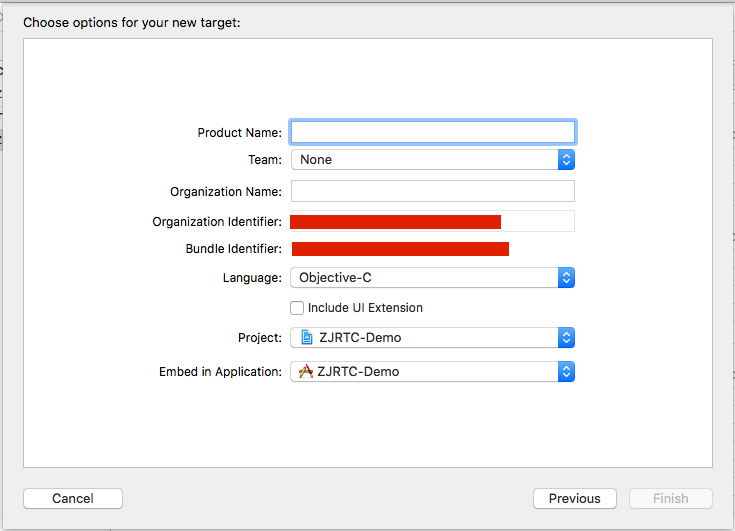
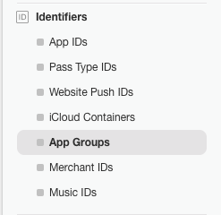

# ZJRTCSDK 说明文档

## 目录

- [目录](#目录)   
- [编写目的](#编写目的)    
- [构建音视频通话 - ZJRTC.framework](#构建音视频通话---zjrtcframework)        
    - [SDK 集成说明](#sdk-集成说明)            
        - [导入sdk文件](#导入sdk文件)            
        - [重新导入库文件](#重新导入库文件)           
        - [添加y头文件路径](#添加y头文件路径)            
        - [向 Other Linker Flags 添加 -ObjC & -lc++](#向-other-linker-flags-添加--objc---lc)      
        - [关闭bitcode](#关闭bitcode)            
        - [在 info.plist 中 - 添加 麦克风 、相机使用权限。](#在-infoplist-中---添加-麦克风-相机使用权限)        
    - [加入会议/点对点通讯](#加入会议点对点通讯)            
        - [配置Api Server Domain 。](#配置api-server-domain-)            
        - [登录用户名到平台](#登录用户名到平台)            
        - [配置音视频通讯需要的参数](#配置音视频通讯需要的参数)            
        - [接收会中音视频](#接收会中音视频)            
        - [会中媒体管理](#会中媒体管理)            
        - [重新连接本次会议](#重新连接本次会议)            
        - [退出会议](#退出会议)        
    - [会议管理/仅会议管理](#会议管理仅会议管理)            
        - [加入会议 文档中有介绍](#加入会议-文档中有介绍)            
        - [管理会议](#管理会议)            
        - [获取会中参会者信息](#获取会中参会者信息)            
        - [获取会中正在展示视频的参会者列表](#获取会中正在展示视频的参会者列表)            
        - [获取会中参会者附加信息（正在发声）](#获取会中参会者附加信息正在发声)           
        - [获取会议室信息](#获取会议室信息)            
        - [对会议室管理 - 录制、直播](#对会议室管理---录制直播)            
        - [对会议室管理 - 布局](#对会议室管理---布局)            
        - [对会议室管理 - 切换会议锁定](#对会议室管理---切换会议锁定)           
        - [对会议室管理 - 切换全部访客静音](#对会议室管理---切换全部访客静音)            
        - [对会议室管理 - 邀请其他参会者](#对会议室管理---邀请其他参会者)           
        - [对会议室管理 - 发送文字信息](#对会议室管理---发送文字信息)            
        - [对会议室管理 - 结束会议](#对会议室管理---结束会议)            
        - [分享](#分享)            
        - [对指定参会者管理 - 切换静音、改名、改变身份、设置焦点、移除](#对指定参会者管理---切换静音改名改变身份设置焦点移除)            
        - [对指定参会者管理 - 允许、拒绝参会者加入会议](#对指定参会者管理---允许拒绝参会者加入会议)

- [构建屏幕录制分享 - ZJRTCScreenShare.framework](#构建屏幕录制分享---zjrtcscreenshareframework)
    - [SDK 集成说明](#sdk-集成说明-1)            
        - [构建Application Extension](#构建application-extension)            
        - [在 apple developer 中创建 相应的group id，并在Xcode中App 和 Extension打开App Groups](#在-apple-developer-中创建-相应的group-id并在xcode中app-和-extension打开app-groups)            
        - [Extension 中 导入sdk](#extension-中-导入sdk)        
    - [屏幕录制分享 - 使用ScreenHelper.h 文件](#屏幕录制分享---使用screenhelperh-文件)            
        - [配置GroupId 。](#配置groupid-)            
        - [连接到分享。](#连接到分享)            
        - [更新录制屏幕的数据流。](#更新录制屏幕的数据流)            
        - [关闭时断开连接。](#关闭时断开连接)

----

## 编写目的
ZJRTCSDK 是紫荆云平台iOS端Obective-C版本SDK。ZJRTCSDK 可以帮助您在十分钟内快速搭建基于浏览器的音视频应用。ZJRTCSDK 使用WebRTC协议构建音视频通话服务，让您轻松应对一对一、多对多音视频通话及实时数据传输等复杂应用场景。本文档帮助你快速集成ZJRTCSDK 到你的项目中。

---- 

## 构建音视频通话 - ZJRTC.framework

ZJRTCSDK 是紫荆云平台iOS端Obective-C版本SDK。ZJRTCSDK 可以帮助您在十分钟内快速搭建基于浏览器的音视频应用。ZJRTCSDK 使用WebRTC协议构建音视频通话服务，让您轻松应对一对一、多对多音视频通话及实时数据传输等复杂应用场景。本文档帮助你快速集成ZJRTCSDK 到你的项目中。 

----

### SDK 集成说明

#### 导入sdk文件 
* 添加目录video-sdk中的ZJRTC.framework & WebRTC.framework 到工程中。

#### 重新导入库文件
* 确保Embedded Binaries 和 Linked Frameworks and Libraries 中添加ZJRTC.framework & WebRTC.framework。

#### 添加y头文件路径
* /path to ZJRTC.framework/Headers 

#### 向 Other Linker Flags 添加 -ObjC & -lc++

#### 关闭bitcode 

#### 在 info.plist 中 - 添加 麦克风 、相机使用权限。

----

### 加入会议/点对点通讯

第一步：配置Api Server Domain 。公有云项目使用默认接口域名，不需要设置。专属云项目需要设置私有接口域名。  
第二步：登录用户名到平台。  
第三步：配置音视频通讯需要的参数，建立音视频连接。主要参数：会议室/用户的短号或长地址、 会议主持人/访客密码(在没有访客密码、呼叫用户的时候可以传空字符串)、 会中/主叫显示名称、音视频接收类型(转发、全编全解)。  
第四步：根据设置的参数，接收会中音视频。  
第五步：会中媒体管理。  

* 相关api介绍：

#### 配置Api Server Domain 。
* api名称：apiServer  
* api类型：属性 NSString *  
* api参数：apiServer：Api Server Domain  

#### 登录用户名到平台
* api名称：- (void)loginWithUsername:(NSString *)name  password:(NSString *)password phone:(NSString *)phone nickname:(NSString *)nickname success:(successBlock)success failure:(failureBlock)failure ;   
* api类型：实例方法  
* api参数：name：用户名  password：用户密码  phone：用户绑定手机号码  nickname：用户注册名称     success：成功回调  failure：失败回调  

#### 配置音视频通讯需要的参数
* api名称：- (void)connectChannel:(nonnull NSString *)channel password:(NSString *)password name:(nonnull NSString *)name success:(void (^)(id))success failure:(void (^)(NSError *))failure ;
* api类型：实例方法
* api参数：channel：会议室/用户地址  password：参会密码  name：会中显示名称   success：成功回调  failure：失败回调

#### 接收会中音视频
* api名称：  
a - (void)ZJRtc:(ZJRtcModule *)module didAddLocalView:(ZJVideoView *)view;  
b - (void)ZJRtc:(ZJRtcModule *)module didAddView:(ZJVideoView *)view uuid:(NSString *)uuid ;  
c - (void)ZJRtc:(ZJRtcModule *)module didRemoveView:(ZJVideoView *)view uuid:(NSString *)uuid;  
* api类型：delegate   
* api参数：  
a module: ZJRtcModule 的示例对象（以下delegate 中均是如此，不再做解释。） view：承载本地视频的界面  
b view：承载远端视频的界面  uuid：当前视频对应参会者的唯一标识  
c view：承载远端视频的界面  uuid：当前视频对应参会者的唯一标识  
* api作用：  
a 接收本地视频。  
b 接收远端视频。  
c 删除远端视频。仅在转发模式入会时有效。  

#### 会中媒体管理
* api名称：  
a - (void)micEnable:(BOOL)enabled;  
b - (void)videoEnable:(BOOL)enabled;  
c - (void)switchCamera;  
* api类型：实例方法   
* api参数：  
a enabled：开启/关闭麦克风  
b enabled：开启/关闭摄像头  
* api作用：  
a 开启/关闭麦克风。  
b 开启/关闭摄像头。  
c 切换摄像头。  

#### 重新连接本次会议
* api名称：- (void)reconnect ;  
* api类型：实例方法  

#### 退出会议
* api名称：- (void)exitChannelSuccess:(successBlock)success failure:(failureBlock)failure;   
* api类型：实例方法  

----

### 会议管理/仅会议管理

会议管理是指本端作为参会者管理会议，仅会议管理是指本端不作为参会者，不占用会议室方数，只进行管理会议。  
第一步：加入会议/管理会议  
第二步：获取会中参会者信息。  
第三步：获取会中会议室信息。  
第四步：使用会议室管理 api。   

* 相关api介绍：  

####  加入会议 文档中有介绍

####  管理会议 
* api名称：- (void)connectChannel:(nonnull NSString *)channel password:(NSString *)password name:(nonnull NSString *)name  success:(void (^)(id))success failure:(void (^)(NSError *))failure ;  
* api类型：实例方法  
* api参数：channel：会议室/用户地址  password：参会密码  name：会中显示名称   success：成功回调   failure：失败回调  type：入会类型（音视频、仅管理）

####  获取会中参会者信息
* api名称：  
a rosterList  
b - (void)ZJRtc:(ZJRtcModule *)module didAddParticipant:(Participant *)participant;  
c - (void)ZJRtc:(ZJRtcModule *)module didUpdateParticipant:(Participant *)participant;  
d - (void)ZJRtc:(ZJRtcModule *)module didRemoveParticipant:(Participant *)participant;  
e - (void)ZJRtc:(ZJRtcModule *)module didUpdateParticipants:(NSArray *)participants;  
* api类型：a 为 属性 NSMutableDictionary *，其他delegate 。  
* api参数：  
a rosterList ：参会者信息列表。  
b c d participant：参会者信息。  
e：参会者列表，每次参会者发生增删改都会触发。  
* api作用：  
a 调用时的参会者列表信息。  
b 会中参会者增加。  
c 会中参会者信息变更。  
d 会中参会者离开。  
e 会中参会者增删改后的列表。  

#### 获取会中正在展示视频的参会者列表
* api名称：- (void)ZJRtc:(ZJRtcModule *)module didLayoutParticipants:(NSArray *)participants;  
* api类型：实例方法  
* api参数：participants：出现在视频中的参会者列表，数组顺序代表展示顺序。  

#### 获取会中参会者附加信息（正在发声）
* api名称：- (void)ZJRtc:(ZJRtcModule *)module didReceivedStageVoice:(NSArray *)voices;  
* api类型：实例方法  
* api参数：voices：参会者附加信息列表，vad为100时代表此参会者正在发声。  

#### 获取会议室信息
* api名称：  
a - (void)ZJRtc:(ZJRtcModule *)module recordAndlive:(NSDictionary *)data;  
b - (void)ZJRtc:(ZJRtcModule *)module layoutChange:(NSDictionary *)data ;  
c - (void)ZJRtc:(ZJRtcModule *)module conferenceChange:(NSDictionary *)data;  
* api类型：delegate  
* api参数：  
a data：录制、直播开启/关闭状态。  
b data：会议室 - 布局，讲堂 - 主持人布局、访客布局。当前仅支持 （大：小）1：0、4：0、1：7、1：21、2：21。  
c data：会议锁定、全部访客静音开启/关闭状态。  
* api作用：  
a 获取当前会议室录制、直播开启/关闭状态。  
b 获取当前会议室布局。  
c 获取当前会议室锁定、全部访客静音开启/关闭状态。  

#### 对会议室管理 - 录制、直播
* api名称:  
a - (void)enableRecordSuccess:(successBlock)success failure:(failureBlock)failure;  
b - (void)disableRecordSuccess:(successBlock)success failure:(failureBlock)failure;  
c - (void)enableLiveSuccess:(successBlock)success failure:(failureBlock)failure;  
d - (void)disableLiveSuccess:(successBlock)success failure:(failureBlock)failure;  
* api类型：实例方法  
* api作用：  
a 打开录制功能  
b 关闭录制功能  
c 打开直播功能  
d 关闭直播功能  

#### 对会议室管理 - 布局
* api名称: - (void)layoutChangeHost:(NSString *)layout guest:(NSString *)glayout conferenceType:(ZJConferenceType )type success:(successBlock)success failure:(failureBlock)failure;  
* api类型：实例方法  
* api参数：layout：布局（主持人布局） glayout：可传空值（访客布局）传值当前仅支持 （大：小）1：0、4：0、1：7、1：21、2：21。  

#### 对会议室管理 - 切换会议锁定
* api名称: - (void)lockMeeting(BOOL )lock success:(successBlock)success failure:(failureBlock)failure ;  
* api类型：实例方法  
* api参数：lock：是否锁定会议室  

#### 对会议室管理 - 切换全部访客静音
* api名称: - (void)muteAllGuest:(BOOL )mute success:(successBlock)success  failure:(failureBlock)failure ;  
* api类型：实例方法  
* api参数：mute：是否静音  

#### 对会议室管理 - 邀请其他参会者
* api名称:   
a - (void)inviteDesitination:(NSString *)dest success:(successBlock)success failure:(failureBlock)failure;  
b - (void)inviteDestination:(NSString *)dest protocol:(NSString *)protocolType alias:(NSString *)name host:(BOOL)isHost streaming:(BOOL)isStreaming success:(successBlock)success failure:(failureBlock)failure;  
* api类型：实例方法  
* api参数：dest：被邀请用户地址 protocolType：呼叫协议类型  name：入会显示名称  host：入会身份是否为主持人 isStreaming   

#### 对会议室管理 - 发送文字信息
* api名称: - (void)sendMessage:(NSString *)message success:(successBlock)success failure:(failureBlock)failure;
* api类型：实例方法
* api参数：message：要发送的文字信息

#### 对会议室管理 - 结束会议
* api名称: - (void)closeChannelSuccess:(successBlock)success failure:(failureBlock)failure;  
* api类型：实例方法  
* api作用：断开当前会议室的所有参会者，并结束会议。  

#### 分享
* api名称：
a - (void)ZJRtc:(ZJRtcModule *)module didStartImage:(NSString *)imageStr;  
b - (void)ZJRtc:(ZJRtcModule *)module didUpdateImage:(NSString *)imageStr uuid:(NSString *)uuid;  
c - (void)ZJRtc:(ZJRtcModule *)module didStopImage:(NSString *)imageStr;  
d - (void)shareImageWith:(NSData *)imageData open:(BOOL )open change:(BOOL )change success:(successBlock)success failure:(failureBlock)failure;  
* api类型：a b c 为 delegate，d 为实例方法。  
* api参数：  
b imageStr：正在会中分享的图片  
d imageData：转成的data  open：开启/关闭分享    
* api作用：  
a 会中有参会者开启分享功能。  
b 会中参会者改变分享内容。  
c 会中参会者停止分享功能。  
d 分享图片到会议中。  

#### 对指定参会者管理 - 切换静音、改名、改变身份、设置焦点、移除
* api名称:  
a - (void)muteParticipant:(NSDictionary *)participant success:(successBlock)success failure:(failureBlock)failure ;  
b - (void)changeNameParticipant:(NSDictionary *)participant withNewName:(NSString *)changedName success:(successBlock)success failure:(failureBlock)failure;  
c - (void)changeRoleParticipant:(NSDictionary *)participant success:(successBlock)success failure:(failureBlock)failure;  
d - (void)spolightParticipant:(NSDictionary *)participant success:(successBlock)success failure:(failureBlock)failure;  
e - (void)removeParticipant:(NSDictionary *)participant success:(successBlock)success failure:(failureBlock)failure;  
* api类型：实例方法  
* api参数：participant：指定参会者   
b changedName：改变之后的显示名，对应参会者信息的 overlayText。  
* api作用：  
a 切换静音  
b 改变指定参会者显示名。  
c 改变指定参会者身份。（主持人、访客）  
d 设置指定参会者为焦点，设置后参会者的视频显示在会议中的第一位。  
e 移除指定参会者。  

#### 对指定参会者管理 - 允许、拒绝参会者加入会议
* api名称:  
a - (void)allowParticipant:(NSDictionary *)participant success:(successBlock)success failure:(failureBlock)failure;  
b - (void)refusedToParticipant:(NSDictionary *)participant success:(successBlock)success failure:(failureBlock)failure;  
* api类型：实例方法  
* api参数：participant：指定参会者   
* api作用：  
此时参会者状态为，会议室已经锁定，参会者以访客身份入会。相当参会者在敲门。  
a 允许指定参会者加入会议。  
b 拒绝指定参会者加入会议。  

----
----

## 构建屏幕录制分享 - ZJRTCScreenShare.framework

* 适用iOS 系统：iOS 11.0以后  
* 使用屏幕录制分享，随时随地分享您的屏幕到会议中。

----

### SDK 集成说明

#### 构建Application Extension
* 选中Xcode - file - Application Extension - Broadcast Upload Extension ，构建时去掉Include UI Extension。

---

---

#### 在 apple developer 中创建 相应的group id，并在Xcode中App 和 Extension打开App Groups

#### Extension 中 导入sdk

---

### 屏幕录制分享 - 使用ScreenHelper.h 文件

第一步：配置GroupId 。  
第二步：连接到分享。  
第三步：更新录制屏幕的数据流。  
第四步：关闭时断开连接。  

* 相关api 介绍：  

####  配置GroupId 。
* api名称：groupId  
* api类型：属性 NSString *  
* api参数：groupId：在apple developer 申请的groupId  

#### 连接到分享。
* api名称：- (void)connect;  
* api类型：实例方法  

####  更新录制屏幕的数据流。
* api名称：- (void)didCaptureSampleBuffer:(CMSampleBufferRef)sampleBuffer;  
* api类型：实例方法  
* api参数：sampleBuffer：录制屏幕的数据流。  

#### 关闭时断开连接。
* api名称：- (void)disconnect;  
* api类型：实例方法  

----

## 版本 v2.0.0

----

## 问题反馈
* 任何关于SDK的问题，您可以在[Issues](https://github.com/zijingcloud/iOS-SDK/issues/new)中反馈。